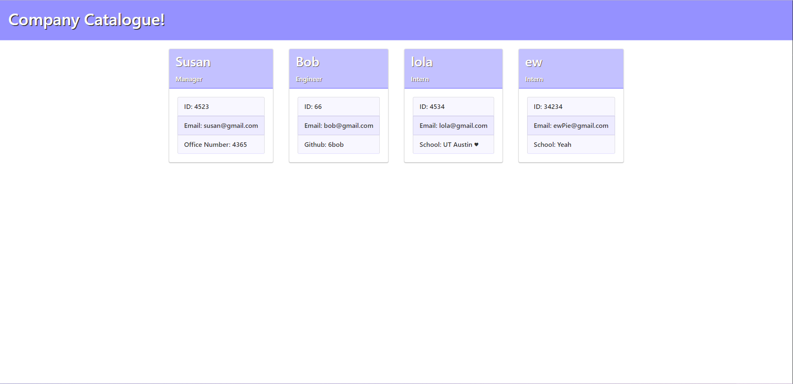

# company-catalogue!
  
  ## Description [](https://opensource.org/licenses/MIT)
  
  Company Catalogue is a NodeJS command-line application that generates an HTML webpage displaying a gallery of employees cards with their respective contact information. Simply run the application, answer the prompts, and check out the created catalogue!
  
  ***

  

  ## Installation 
  To install the Company Catalogue, run the following commands: 
  
  ```
  git clone https://github.com/kierstenv/company-catalogue.git
  npm install --saveDevs
  ```
  
  ## Usage 
  To use the Company Catalogue, run &nbsp;`node index.js`, &nbsp;and answer the prompted questions. Open the [companyCatalogue.html](./dist/companyCatalogue.html) file in the browser to see the page!
  
  For a visual walkthrough, watch the [demo video](https://watch.screencastify.com/v/4dYuC6aJ3KarTlHVx5g7).

  ## License

  Licensed under the MIT license. See [LICENSE](./LICENSE) for more information.

  ## Credits 
[](https://techbootcamps.utexas.edu/coding//)
  